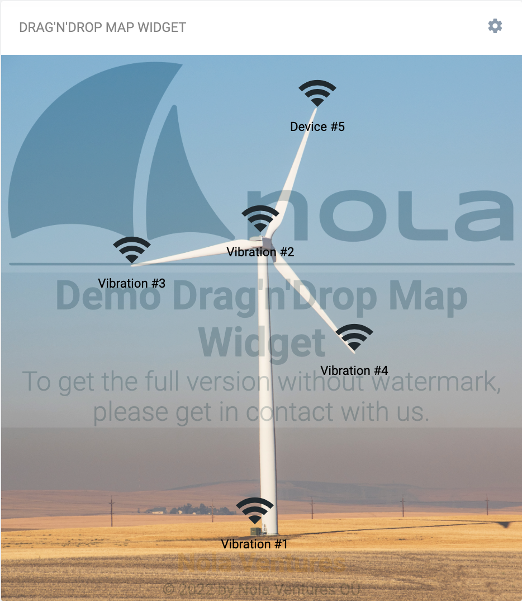
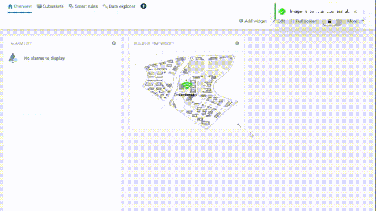
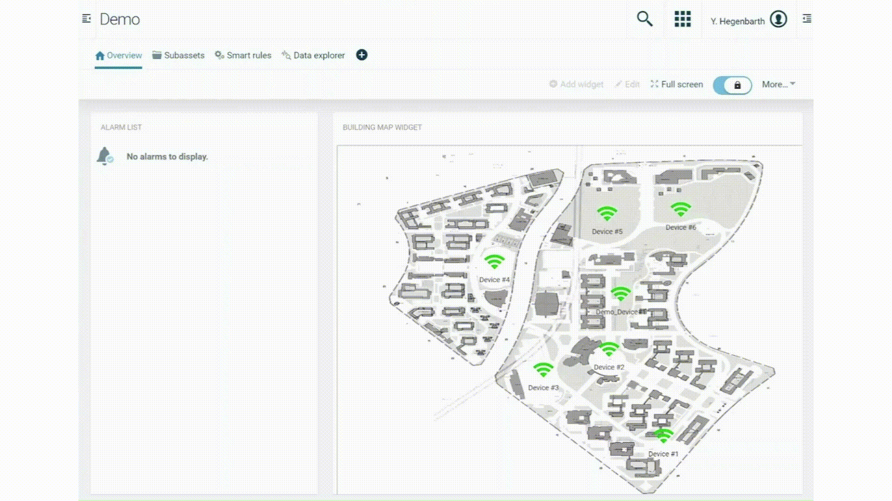

# Cumulocity Drag'n'Drop Map Widget 

## Table of Contents
- [Overview](#overview)
- [Installation](#installation)
- [Usage](#usage)
	- [Upload Map picture](#upload-map-picture)
	- [Drag-and-Drop devices](#drag-and-drop-devices)
	- [Real-time alerting](#real-time-alerting)

## Overview

The `Cumulocity Drag'n'Drop Map Widget` designed for the Cumulocity IoT Cloud Platform, is a simple map view with drag-and-drop functionality to position your IoT devices accordingly.

### **Examples how the Drag'n'Drop Map Widget can be used:**

            | 
:-------------------------:|:-------------------------:
*Widget displaying a custom map and self-service positioned devices.*  |  *Widget displaying a wind turbine and self-service positioned sensors.*

 

`Note: Drag'n'Drop Map Widget is supported on Cumulocity UI version of 10.14 and above.`

## Installation
The `Drag'n'Drop Map Widget` is shipped as a standalone application for now. This means it will be installed as a separate application, which provides all the features of the
`Drag'n'Drop Map Widget` as `Nola Cockpit` application. The standalone application is available in the [release section](https://github.com/Nola-Ventures/cumulocity-dragndrop-map-widget-demo/releases)
and can be downloaded.

### For installation of cockpit web application:

1. Download *{release}*.zip
 from the [release section](https://github.com/Nola-Ventures/cumulocity-dragndrop-map-widget-demo/releases)
2. Open the `Administration` application in your Cumulocity tenant
3. Navigate to `Ecosystem` --> `Applications`
4. Click on `Add application`
5. Select `Upload web application` in the modal dialog
6. Select the zip archive, which you downloaded from the release section, to upload it to the tenant

	

<i>Upload Nola Cockpit Web Application.</i>
 

After following these instructions, the application will be deployed on the tenant and is ready for use. In the application switcher on the top right you can now select the `Nola Cockpit` application.

Using the `Nola Cockpit` application you have access to the `Drag'n'Drop Map Widget` for your dashboards.

## Usage

Using the widget, it is assumed that the IoT devices of interest are already registered in the cloud. For administrative management, it is usually common to create some group structure and assign the IoT devices and sensors to these groups.

After doing this, start creating a new dashboard using the `Nola Cockpit` application and add the new `Drag'n'Drop Map Widget`.

### Upload Map picture:

Add a new widget to your dashboard and select `Drag'n'Drop Map Widget`. Now just upload your property or building outline as image file (JPG or PNG).

	

<i>Upload a custom map image to display.</i>
 

### Drag-and-Drop devices:

After the image file has been successfully uploaded, now comes the fun part 😁
**The individual placement of the sensors!**

The devices assigned to the group are displayed on the map and can be moved by mouse click. Once you are done with the placement of the devices, the setting is saved by locking the dashboard (🔐 top right).

	

<i>Drag-and-drop all devices related to the corresponding group. Afterwards,  lock the dashboard.</i>
 

### Real-time alerting:

That’s it!🎉 The widget is now individually configured and displays the current status of the sensors within a group in real time. By using traffic light colours🚦the viewer immediately sees which sensors are sounding an alarm and where the sensors are located on the property. If a sensor is currently deactivated or has not sent any data to the platform for a predefined time, the sensor icon is shown in grey.

If the user wants to know more details about the sensor in question, simply click on the relevant sensor and the dashboard view for the sensor will be displayed. Here the user has the possibility to view and evaluate all sensor readings and statuses in the history.

As soon as the alarms have been confirmed and the sensor switches to the normal state, the sensor icons in the Drag'n'Drop Map Widget switch back to the colour green.🟢

	

<i>Real-time alert shown in traffic light colours. Link to device dashboard for more insight.</i>
 

## Any comments, suggestions or ideas?

Let us know, if the current way for setting up and using the widget meets your needs and expectations. For any suggestions, please navigate to [Issues](https://github.com/Nola-Ventures/c8y-building-map-widget/issues) and open a new issue with all the relevant details. Once you have created your issue, we will make sure to assign the correct label to it, which will help us to categorize your issue:

* 🐞 use "bug" for something that is not working
* 📖 use "documentation" for any feedback about the documentation
* 💡 use "idea" for every new idea, feature request or suggestion
* ❓ use "support" for questions or anything that needs further assistance

**Thanks for your contribution!**

_________________

These tools are provided as-is and without warranty or support. Users are free to use, fork and modify them, subject to the license agreement. While Nola Ventures OÜ welcomes contributions, we cannot guarantee to include every contribution in the master project.
